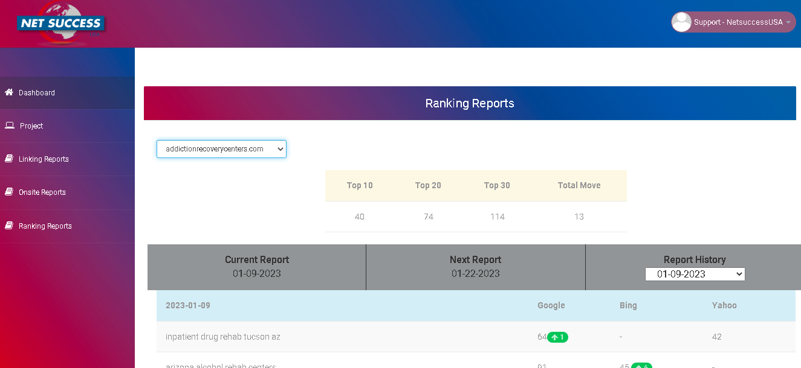

# SEO Report 2.0

> This is SEO Report Project (version 2)
> Live demo [_here_](https://www.theseoreporting.com/login). <!-- If you have the project hosted somewhere, include the link here. -->

## Table of Contents

- [General Info](#general-information)
- [Technologies Used](#technologies-used)
- [Features](#features)
- [Screenshots](#screenshots)
- [Setup](#setup)
- [Usage](#usage)
- [Project Status](#project-status)
- [Room for Improvement](#room-for-improvement)
- [Acknowledgements](#acknowledgements)
- [Contact](#contact)
<!-- * [License](#license) -->

## General Information

- This is ongoing project of SEO Report (version 1).
- Ranking report is generated automatically.
- Show better SEO report by using Advanced Web Ranking API.
- The reason I undertook this is I have done version 1 of this project.
<!-- You don't have to answer all the questions - just the ones relevant to your project. -->

## Technologies Used

- PHPOffice/phpspreadsheet
- AWR API
- Ajax

## Features

List the ready features here:

- Excel Viewer
- Rank report auto generation
- Logo upload

## Screenshots

<!-- If you have screenshots you'd like to share, include them here. -->

## Setup

Just used PHP & MySQL so only need of XAMPP environment.
Set document root of apache as project path

## Usage

Login as client and feel free to see seo reports.

## Project Status

Project is: _in progress_.

## Room for Improvement

These are areas of need improvement / could be improved. Also TODOs for future development.

Room for improvement:

- Working with phpspreadsheet
- Ajax XMLHTTP Request

To do:

- Use framework
- Terrible Zip extract issue fix

## Acknowledgements

Give credit here.

- This project was inspired by Deepak Bansal.
- This project was based on [this tutorial](https://www.advancedwebranking.com/docs/developer-api-v2.html#apiv2-overview).
- Many thanks to Deepak Bansal.

## Contact

Created by [@violetstar701](https://www.flynerd.pl/) - feel free to contact me!

<!-- Optional -->
<!-- ## License -->
<!-- This project is open source and available under the [... License](). -->

<!-- You don't have to include all sections - just the one's relevant to your project -->
